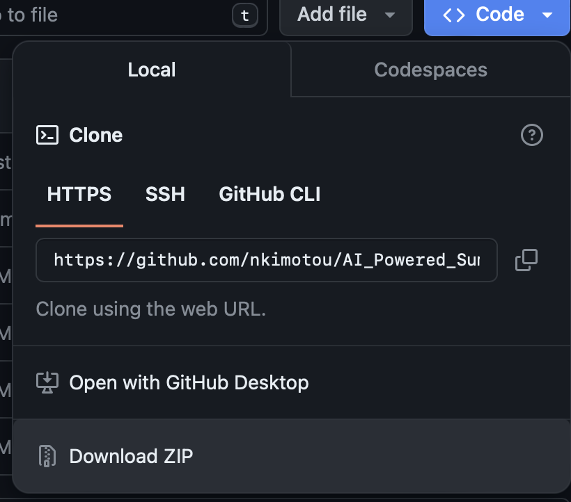
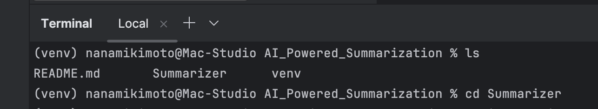
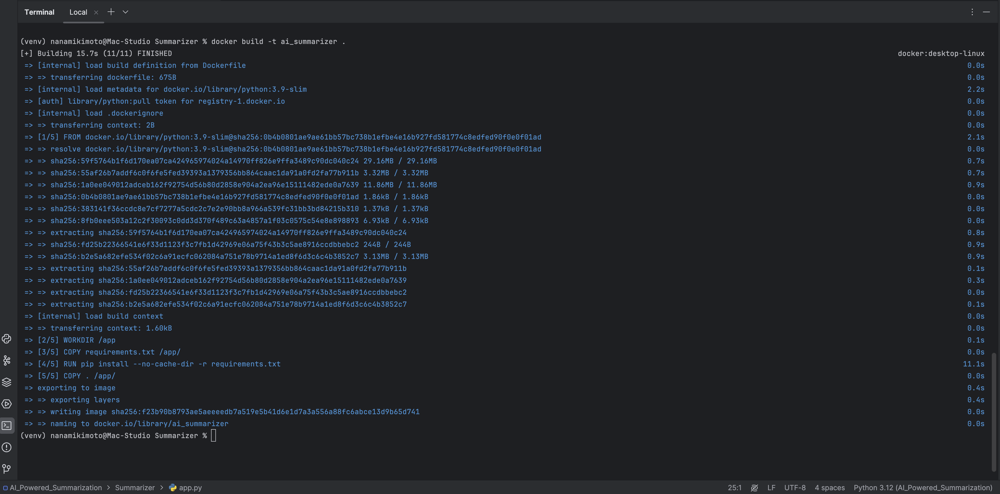
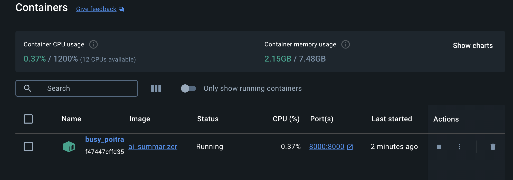
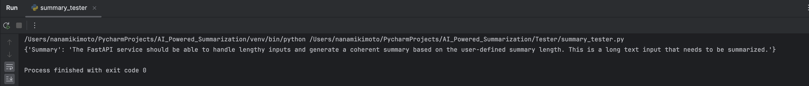
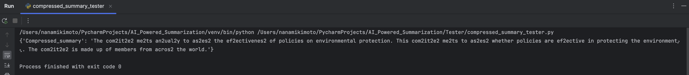
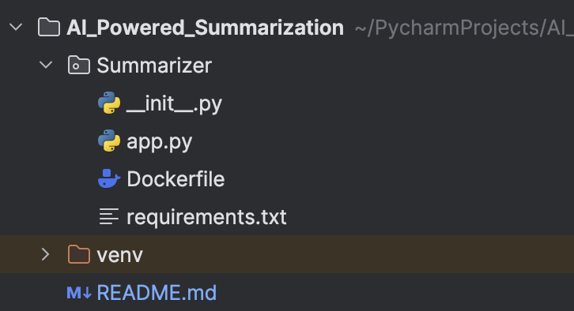

# AI_Powered_Summarization
Rad AI ML infrastructure engineer challenge

## Table of Contents

- [Instructions](#instructions)
- [Requirements](#requirements)
- [Developer Notes](#developer-notes)
- [Process](#process)
- [How to run this application locally](#how-to-run-this-application-locally)
- [How to create your own version from scratch](#how-to-create-your-own-version-from-scratch)
- [Documentation](#documentation)

## Instructions
Create a FastAPI service that loads a pre-trained Hugging Face NLP model to do text summarization on user-provided text inputs. The service should expose an API to receive a text input and return a summary in a JSON Response.

### Requirements
-Set up a Python environment with the dependencies (FastAPI, Hugging Face Transformers, anything else you see fit).

-Choose a pre-trained NLP model from the Hugging Face Model Hub that is suitable for text summarization.

-An endpoint that takes a JSON input, for the user provided text and returns a response with the result. An example request-response can be like:

``{
"text": "This is a long text input that needs to be summarized. The FastAPI service should be able to handle lengthy inputs and generate a coherent summary based on the user-defined summary length...",
"summary_length": 50
}
``

``
{
"summary": "A brief summary of the lengthy input text, generated by the pre-trained Hugging Face model."
}
``

-Containerize the FastAPI service using Docker, and provide a Dockerfile and instructions on how to build and run the Docker container.

-Include a README that explains how to run a service.
## Optional (extension of the original task)
After generating the summarized text, compress it using the following algorithm and return the compressed summary string.

**Compress Summary Endpoint:** 

Implement a POST endpoint /compress_summary that accepts the same input as /summarize and returns the compressed summary string.

**The compression algorithm is as follows:**

For each group of consecutive repeating characters in the summarized text:

-If the group's length is 1, append the character to the compressed string.

-Otherwise, append the character followed by the group's length.

-The compressed string should be returned in the JSON response from the /compress_summary endpoint.’

**Original Summary:** 
`This committee meets annually to assess the effectiveness of policies on environmental protection.`

**Compressed Summary:**
`This com2it2e2 me2ts an2ual2y to as2es2 the ef2ectivenes2 of policies on environmental protection.`

***
## Developer Notes
I've created this with the intention of making it very easy for someone not familiar with the used tools 
to be able to run this application with no major issues. 

There are two sections for running this application. One that shows how to run this very same
application I've built, and another that shows how you can build your own based on what I've done.
They are similar instructions, save for a few differences in wording and requirements. 

I've left much more frequent comments in the included files than I usually would, in order to explain everything line by line. 
Ideally, an intern should be able to take this app and fully understand everything from end to end. 

For requirements.txt, you should be able to have your dependencies directly installed by using this command
in the Dockerfile: 

`RUN pip install --no-cache-dir -r requirements.txt`

However, I ran into some issues using this method. I directly specified which dependencies to pip install
depending on what Docker container errors I had. I have left the file the way I am running it locally. You may 
use either of these methods.

Please reach out to me at [nkimotou@gmail.com](nkimotou@gmail.com) for any questions or clarification. 

***
## Process
**Python environment:**

I'm using JetBrains PyCharm IDE running Python 3.12 on a 2023 Mac Studio M2 Max 32gb ram. 
All of my commands are executed by accessing the terminal inside the IDE. 

**Imports and dependencies:**

-FastAPI package to import the FastAPI class to build the service, HTTPException to flag web server status codes.

-Hugging Face transformers package to import the pipeline function for running tasks against models.

-Pydantic package to import the BaseModel class for converting Python objects into usable JSON.

-Uvicorn to be used alongside FastAPI to run the web application in the localhost.

-Torch (pyTorch), Tensorflow, and Keras are required for the BART model to work. 

***
## How to run this application locally
**Step 1:** Download this repo as a zip file and unzip it in your desired location
>

**Step 2:** Dependencies
> Make sure you have the necessary dependencies installed on your machine or inside your Python IDE.
> The app.py and requirements.txt files show the dependencies required.
>
> From app.py:
> 
> `from fastapi import FastAPI, HTTPException`
> 
>`from transformers import pipeline`
> 
>`from pydantic import BaseModel`
> 
> From requirements.txt:
> 
> `fastapi`
> 
>`transformers`
> 
>`uvicorn`
> 
> `torch`
> 
> `tensorflow`
> 
> `tf-keras`
> 
>**Note:** Torch, Tensorflow, and Keras as required to use the BART model from Hugging Face. 

**Step 4:** Set up Docker, build the image, and run the container
> If you don't already have it installed, you can do so on command line or from
> Docker's website. Navigate to the appropriate package directory inside the unzipped repo file
> using the terminal. 
> 
> 

> Once in the correct path, execute the following command:

`docker build -t ai_summarizer .`

> After setting up docker and building the image, run the container using the following command:

`docker run -d -p 8000:8000 ai_summarizer`

> Check that your container is running properly by using the following command:

`docker ps`
> This will return information about your running containers and their status.
> 
> It should look similar to this:
> 
> 

>If you have Docker desktop installed, you can also check the status of your containers that way.
> 
> This is what it should look like:
> 
> 

**Step 5:** Check your localhost!
>You should now be able to access this service through your localhost.

`http://localhost:8000/ai_summarizer/`

>If you're seeing "internal service error", retrace your steps above and make sure your container is still running. 
> If it's not running, and it's exited, check Docker desktop for any console errors that need to be resolved.

**Step 6:** Test your FastAPI service
>You can test your service to make sure the summarization process is correctly working by using a Python script
> that sends a post request to the FastAPI endpoint with the summary. The script prints the response in JSON format.
> 
> See included files 'summary_tester.py' and 'compressed_summary_tester.py' to test your service.
> 
> Here is the output of the included tester files:
> 
> 
> 
> 

***
## How to create your own version from scratch
**Step 1:** Package and directory
> Create a package that will contain everything needed to run the application. In this case,
> mine is called "Summarizer". When you create a package, it should auto create your init.py file for you.

**Step 2:** Interpreter settings
>Make sure your IDE has interpreter settings set to allow a virtual environment, or venv, to be used. 
> This is what it should look like:

> 

**Step 3:** Create the files required inside your package
> For this project, you want to create three files:
> 1. Your app file that has the summarizer code in it
> 2. Your Dockerfile that has instructions to pass to Docker, in order to build the Docker Image.
> 3. Your requirements.txt that has my required dependencies in order for the application to run containerized in Docker.
> 
> The structure can be seen above.

**Step 4:** Set up Docker, build the image, and run the container
> If you don't already have it installed, you can do so on command line or from
> Docker's website. Navigate to the appropriate package directory inside the unzipped repo file
> using the terminal. 
> 
> 

> Once in the correct path, execute the following command:

`docker build -t <docker_image_name>`

> After setting up docker and building the image, run the container using the following command:

`docker run -d -p <your_port:your_port> <docker_image_name>`

> Check that your container is running properly by using the following command:

`docker ps`
> This will return information about your running containers and their status.
> This is what my docker process looks like:
> 
> 

>If you have Docker desktop installed, you can also check the status of your containers that way.
> 
> This is what mine looks like using Docker desktop on Mac:
> 
> 

**Step 5:** Check your localhost!
>You should now be able to access your service through your localhost. 

`http://localhost:<your_port>/<docker_image_name>/`
> In my case, mine looks like this:

`http://localhost:8000/ai_summarizer/`

**Step 6:** Test your FastAPI service
>You can test the service to make sure the summarization process is correctly working by writing a Python script
> that sends a post request to the FastAPI endpoint with the summary. Instruct your script to print the response in JSON format.
> 
> See included files 'summary_tester.py' and 'compressed_summary_tester.py' to test your service.
>
> Here is the output of the included tester files:
> 
> 
> 
> 
***

## Documentation
About the Hugging Face BART model for text summarization:
https://huggingface.co/facebook/bart-large-cnn

Installing and using FastAPI: https://fastapi.tiangolo.com/tutorial/

Installing and using Docker to containerize apps: https://docs.docker.com/get-started/

Installing and using Uvicorn for Python web server: https://www.uvicorn.org/#quickstart

